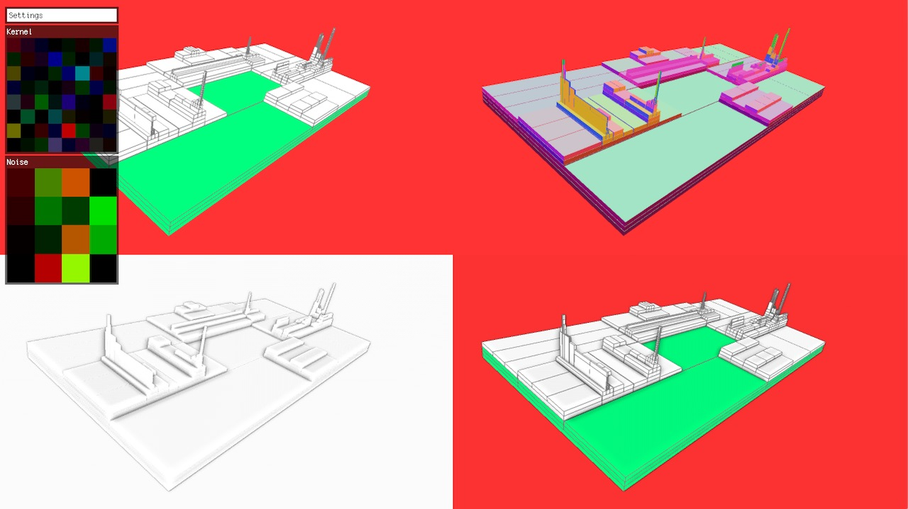
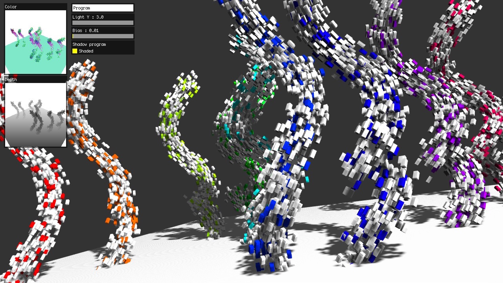
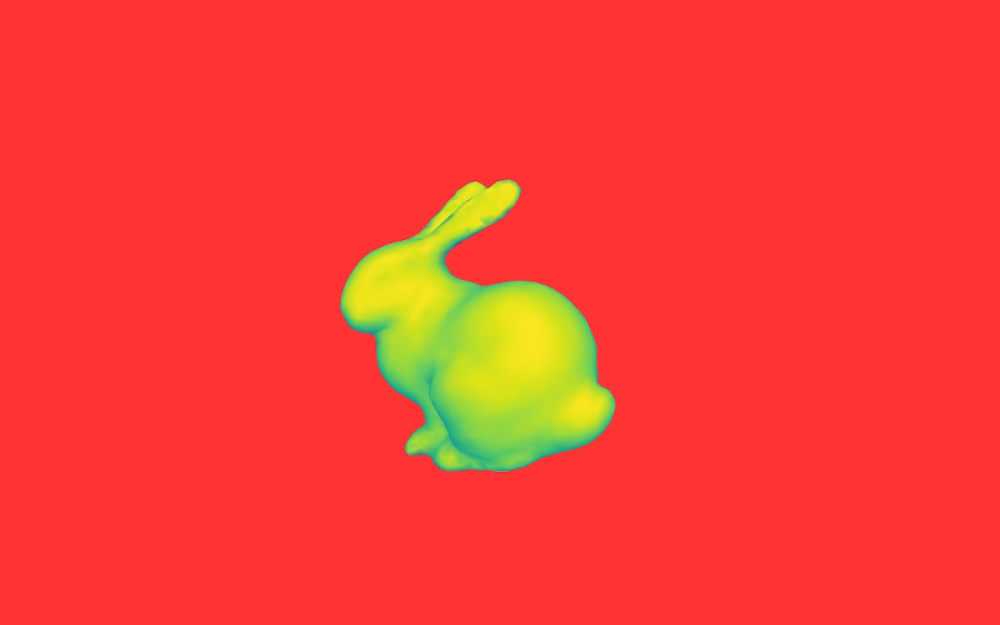
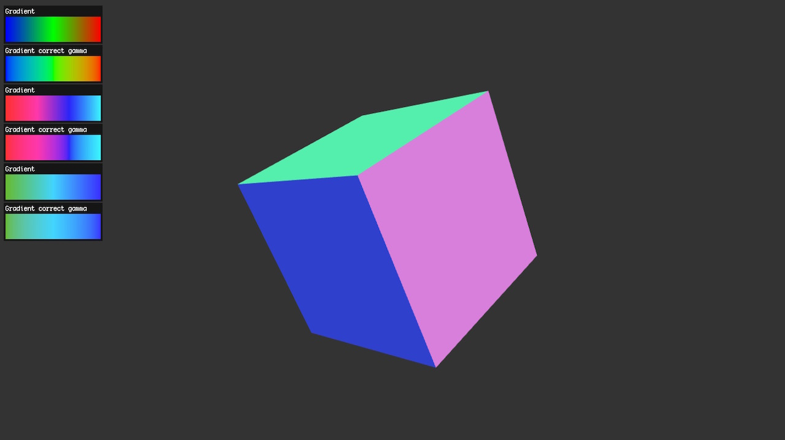

Collection of experiments using [PEX](http://pex.gl) library for WebGL.

## License

MIT, see [LICENSE.md](http://github.com/vorg/pex-experiments/blob/master/LICENSE.md) for details.

## Experiments

| Screenshot  | Name |
| ------------- | ------------- |
| | [blocks](/blocks) - procedural geometry and SSAO |
| | [graph](/graph) - 2D graph drawing and editing |
| | [instanced-stream](/instanced-stream) - instancing with shadows |
| | [shadows](/shadows) - soft shadow maps|
| | [d3-scale-gradient](/d3-scale-gradient) testing build-in gradients from d3|
| | [gradient-gamma](/gradient-gamma) - gamma correction influence on color interpolation|
| | [benchmark](/benchmark) - simple cube benchmark|
