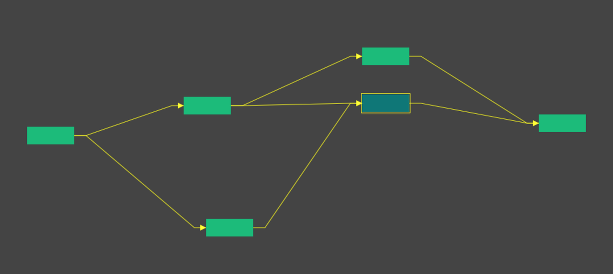

# graph



2D Node graph drawing and editing

## Usage:
- double click to add node
- click + drag to move node
- shift + drag to link nodes

State is saved to `nodes.json` in Plask and `localStorage` in the browser

## Graph Format

```javascript
Nodes = [Node, Node, ..]

Node = {
    "id": 1,
    "x": 58.24609375,
    "y": 313.27734375,
    "width": 80,
    "height": 30,
    "selected": false, //UI state
    "dropTarget": false, //UI state
    "outs": [ //target nodes IDs
      2,
      3
    ]
  }
```
