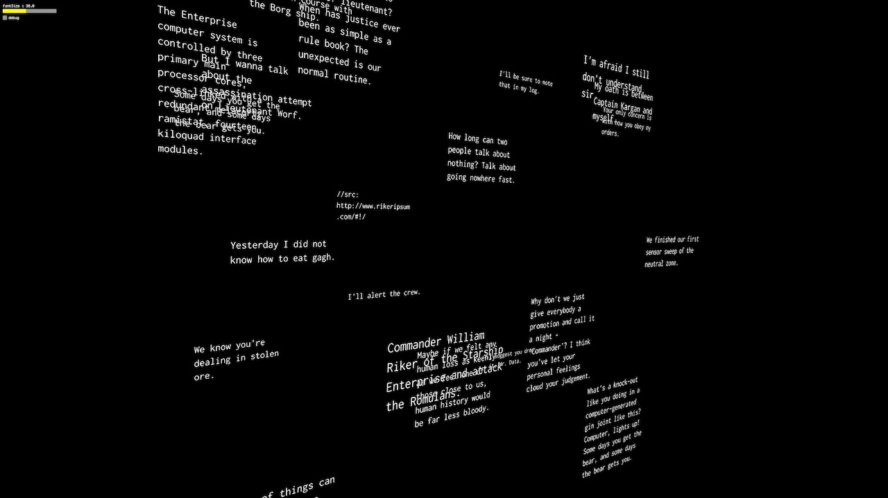

# sdf-text



Text rendering using Signed Distance Fields and standard derivatives for crisp antialiasing at any zoom level.

# How to

## Image generation

https://github.com/libgdx/libgdx/wiki/Distance-field-fonts

1. Install BMFont app for Windows and generate .png texture file and .fnt metrics file.

## Conversion

https://github.com/mattdesl/bmfont2json
https://www.npmjs.com/package/image-sdf

```
npm install bmfont2json -g
npm install image-sdf -g
```

https://github.com/libgdx/libgdx/wiki/Distance-field-fonts
https://libgdx.googlecode.com/files/hiero.jar


# More info

- http://mattdesl.svbtle.com/material-design-on-the-gpu  
- https://www.npmjs.com/package/glsl-aastep
- https://news.ycombinator.com/item?id=10004249

Texts from https://www.npmjs.com/package/glsl-aastep
