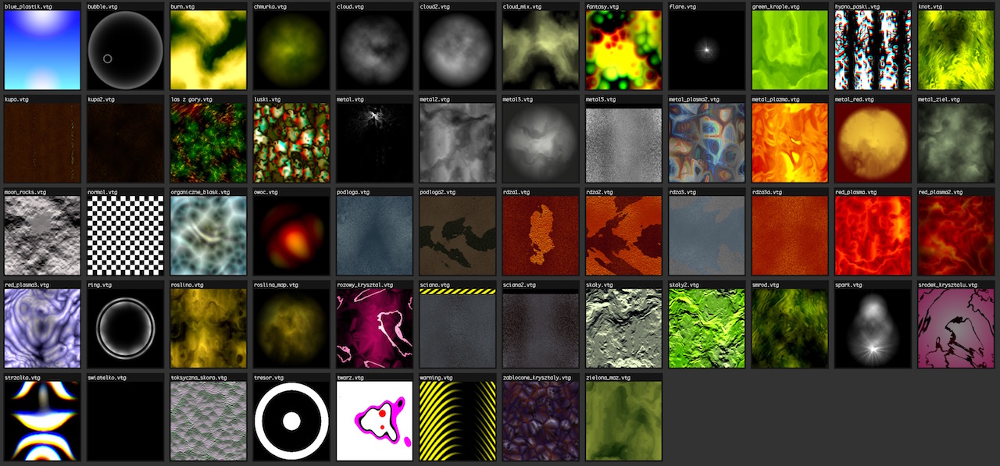
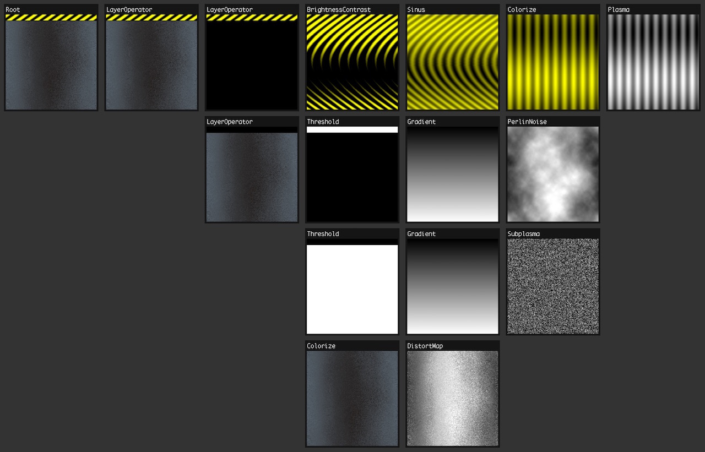

# vtg

A JavaScript port of C++ [Vorg's Texture Generator](http://marcinignac.com/projects/vtg/) from 2004 that was used in 64kb demoscene intro ["Borntro"](http://marcinignac.com/projects/borntro/) by DMA.

This code parses binary `*.vtg` files, builds the filter graph and executes it resulting in 256x256 RGB pixel array.

Example steps necessary to build a wall texture:

## TODO:

- [ ] pseudoranom number generator doesn't work in JS due to int overflow
- [ ] some filters are rotated (due to array memory layout?)
